# 《程序设计实训》大作业文档

学号：2021012533		姓名：沈之洋		班级：未央-软件11

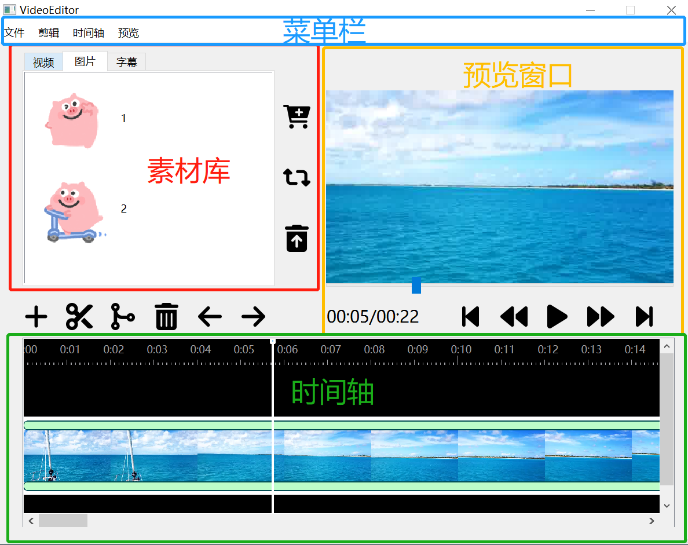

## 各个模块之间的逻辑关系

* MainWindow: 主窗口类，主要包含四个模块：菜单栏/工具栏，素材库，时间轴TimeLine，预览窗口PreviewWindow
  * 菜单栏/工具栏：涵盖了该程序的几乎所有功能，包括：
    * 文件导入导出
    * 素材剪辑与特效
      * VideoCutDialog: 处理视频裁剪的对话框，可将某个选中的视频进行裁剪，并自动保存至视频列表中
      * FadeEffectDialog: 实现淡入淡出特效的对话框
      * MoveEffectDialog: 实现平移特效的对话框
      * SizeEffectDialog: 实现缩放特效的对话框
    * 时间轴管理
    * 预览窗口播放管理
  * 素材库：管理视频、图片、字幕素材，将导入的素材形成视频列表、图片列表与字幕列表
    * VideoView: 维护视频素材的图标、路径、名称等属性
    * ImageView: 维护图片素材的图标、路径、名称等属性
    * SubtitleProcesser: 维护字幕素材的路径、名称等属性，并对 `.srt` 的字幕文件格式进行解析
  * 时间轴TimeLine：管理视频、图片、文字素材的时空位置信息
    * VideoTimeLine:  维护了时间轴中的视频，包含帧率、每一帧图片、视频总时长、视频路径等属性
    * ImageTimeLine: 维护了时间轴中的图片素材，包含时空位置、图片、特效参数、路径等属性
    * TextTimeLine: 维护了时间轴中的文字素材（“文字”包含了“字幕”），包括文字内容、样式、颜色、时空位置等属性
  * 预览窗口PreviewWindow: 实现了剪辑之后的视频的实时播放。预览窗口包含了视频当前帧的画面、视频的总时长与当前时长、以及多种操作按钮（播放/暂停、前进、后退、跳转到开始、跳转到结束）
    * MySlider: 继承 QSlider，实现的滑块类。拖动 slider 可改变当前显示在预览窗口的帧数
  * 其它
    * Utils namespace: 包含了一些全局定义和方法，例如将 qint 表示的时间转换成 QString 格式
    * ffmpeg namespace: 包含了需要用到的 fmmpeg 指令，例如抽帧、裁剪、导出

模块间的关系：

* 素材库 ----> 预览窗口：可以将素材库里的图片拖入预览窗口，进行添加
* 预览窗口 ----> 时间轴：在预览窗口可双击添加文字素材，并且将其实时地加入到时间轴中
* 时间轴 ----> 预览窗口：时间轴上有一指针，指向当前所在帧。通过点击改变该指针的位置，可改变预览窗口中显示的时间
* 素材库 ----> 时间轴：在选中素材库中的某个素材后，可以按下“添加”按钮，将其添加入时间轴

## 程序运行的主要流程

首先，进入程序后，选择“文件”——“导入”，或直接点击形如购物车的导入按钮，即可导入素材。如下图。

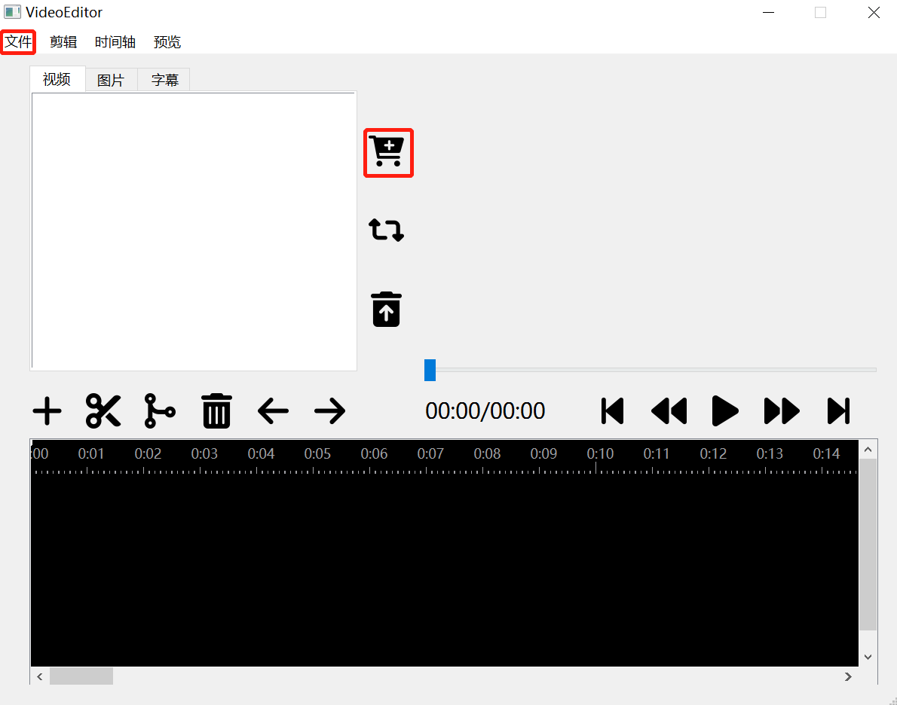

注意到，对“素材库”中的三种素材（视频、图片、字幕），用户**必须先选择具体导入哪一类素材**，才能进行添加。例如，如果选择“图片”，则只可导入特定格式的图片文件，而不能导入视频或字幕。

导入后，选中一个视频素材，点击“**添加**”按钮，可以将其加入时间轴。

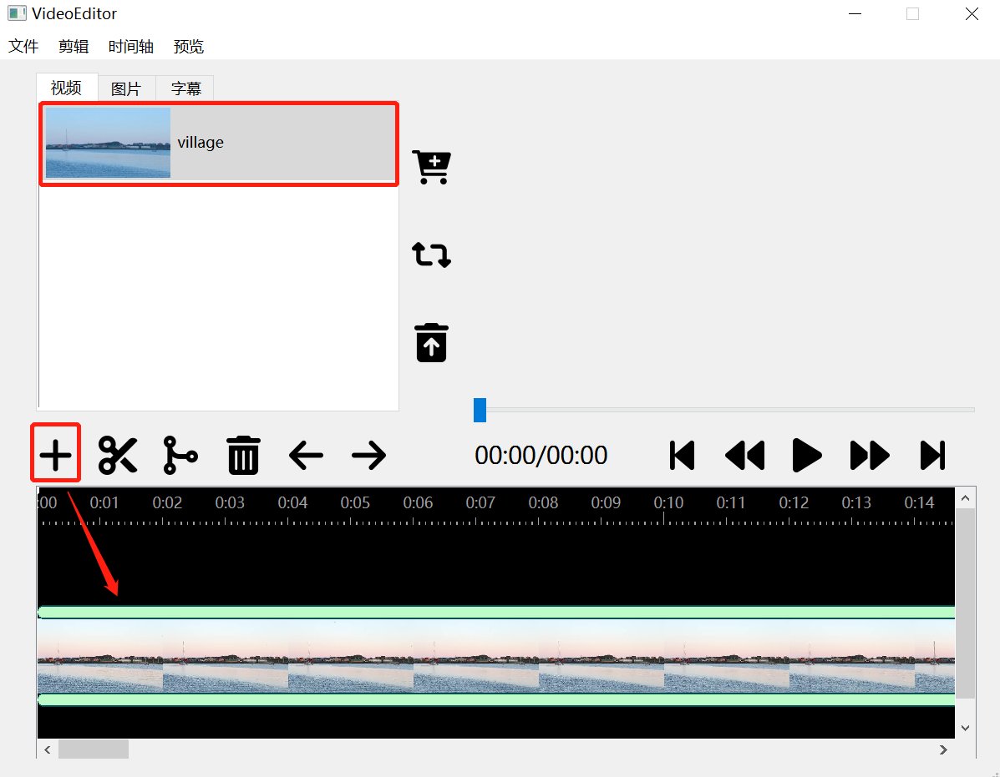

此时可以按下“**播放**”按钮，或按空格键，在右上角的预览窗口就会显示出视频。

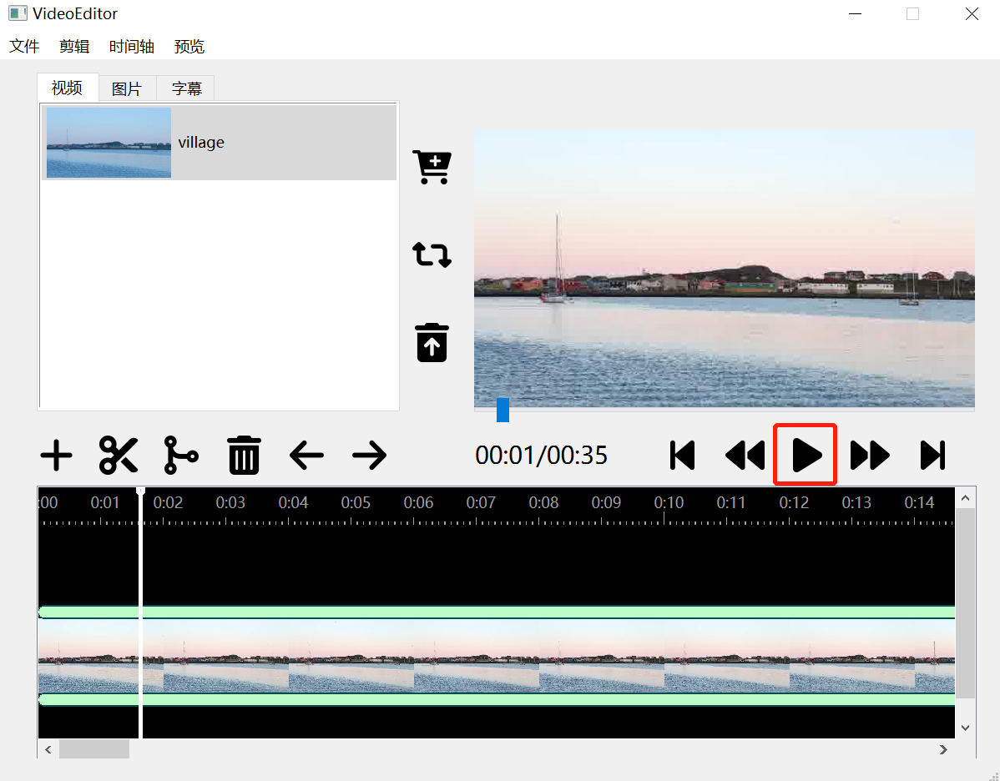

若有视频正在播放，则可以操纵预览窗口下方的五个按钮，来调整视频播放。也可以在时间轴上点击任意位置，即可将时间轴指针移动到该位置。

导入图片或字幕后，同样可以按下“**添加**”按钮，将图片或字幕添加到时间轴中。也可以直接将图片从素材库拖拽到预览窗口，或者在预览窗口双击添加文字。

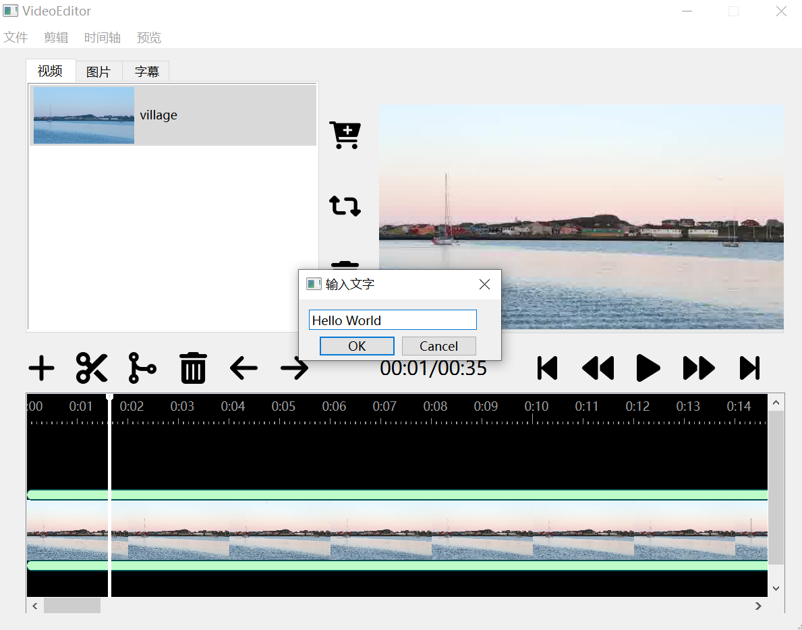

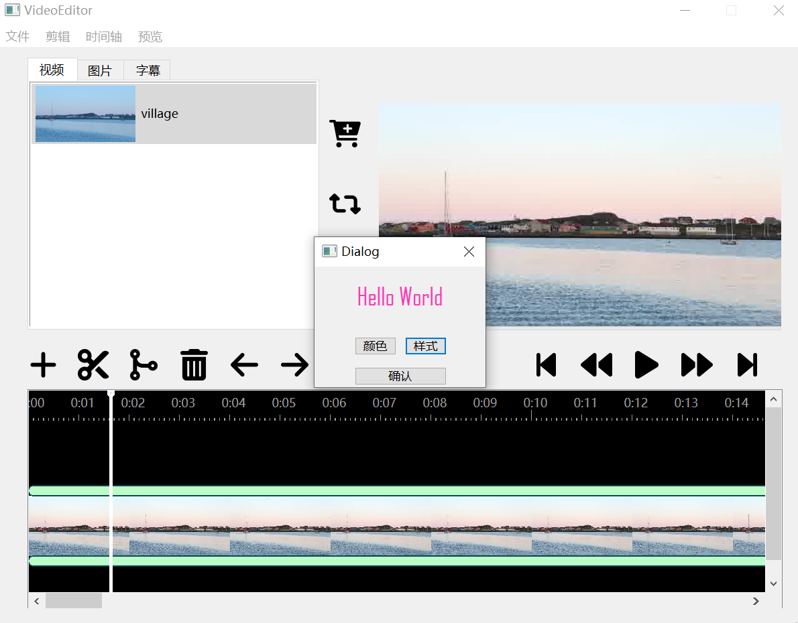

可直接在预览窗口中拖动文字，移动其位置。

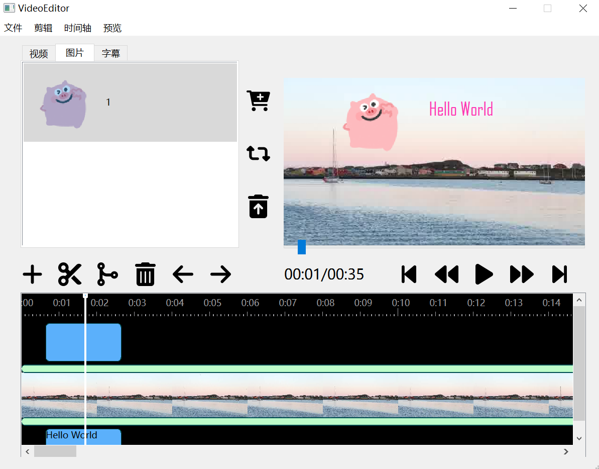

在时间轴中，图片、视频、文字分别占据着一条“**轨道**”，鼠标左键即可选中对应轨道（背景会从黑色变成白色）。当前选中的轨道即代表着用户可以编辑的轨道。例如，如果选中的是图片轨道，则可以对图片素材进行时空位置的调整、或是删除某个图片素材。如果选中的是视频轨道，还可以对其进行分割、合并、调整位置等功能。

对图片素材，用户还可以点击“剪辑”菜单，为其添加特效——<u>淡入淡出、平移、缩放</u>。剪辑菜单中的“**裁剪**”选项也可以对视频进行单独的裁剪，并将裁剪后的新视频添加到视频列表中，以供进一步编辑使用。

完成视频编辑后，可以点击“文件”——“导出”，将视频导出到指定的路径下。

## 各个功能的演示方法

### 导入视频

素材库中先选择“视频”，然后点击“文件”——“导入”，即可导入视频；或点击“购物车”按钮直接导入视频。

可添加的视频格式为 mp4, mkv, avi。

### 导入图片、字幕

素材库中选择“图片”或“字幕”，之后方法同上。

可添加的图片格式为 png, xpm, jpg, jfif。可添加的字幕格式为 srt。

### 素材重命名

选中某个素材（视频/图片/字幕），点击“重命名”按钮（如下图所示），或点击“文件”——“重命名”，在弹出的文本框中输入新名称即可。

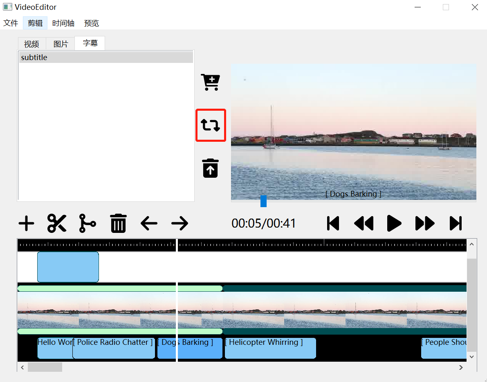

### 素材库中删除素材

选中某个素材，点击“垃圾桶”按钮，或点击“文件”——“删除”，即可删除该素材。

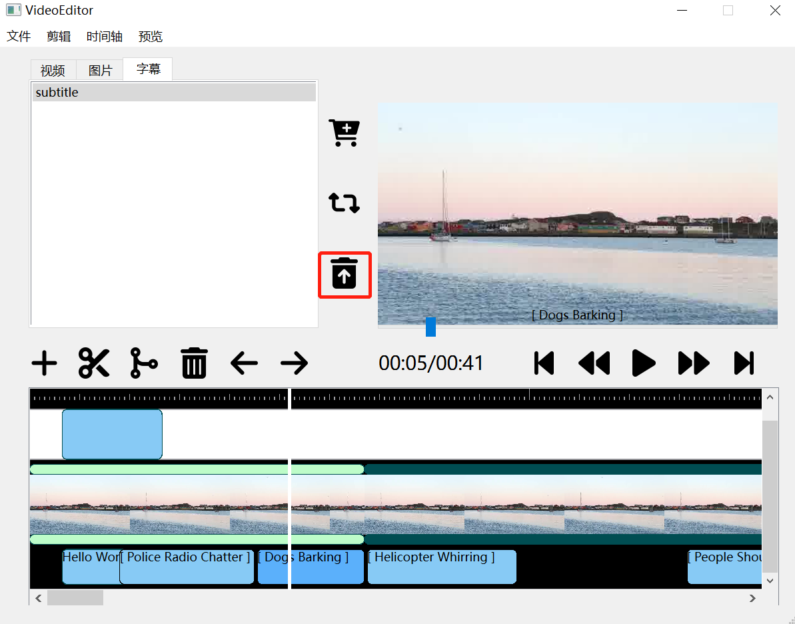

### 将素材加入时间轴

选中某个素材，点击时间轴上方的”添加“按钮，即可将其加入时间轴。也可以点击“时间轴”——“添加”。

对于图片素材，默认其存在的位置是视频左上角，时间范围是当前指针所在位置前后各一秒。

对于视频素材，默认直接导入视频轨道的最后时刻。

对于字幕素材，将直接解析对应的 .srt 文件，并将字幕显示在正确的位置。

### 将素材加入时间轴（提高要求）

对于素材库中选中的图片，也可以直接将其拖拽入预览窗口的任意位置，从而在此时刻添加入时间轴。

而对于文字素材，可以直接在预览窗口双击添加文字。与字幕不同，用这种方式添加的文字素材还可以改变颜色、样式、空间位置等属性，而字幕在导入后就只能修改时间位置。

### 视频裁剪

选中视频列表中的某个视频，点击“剪辑”——“裁剪”，可通过设置前后两个断点的方式，将视频进行裁剪。裁剪过后得到的新视频将被自动添加进视频列表中。

### 视频切分

在时间轴中，将指针移动到任意位置，按下“剪刀”按钮，或点击“时间轴”——“分割”，即可将视频以该时刻为界，拆分成两个子视频。能明显地看到视频被切分成了两段。

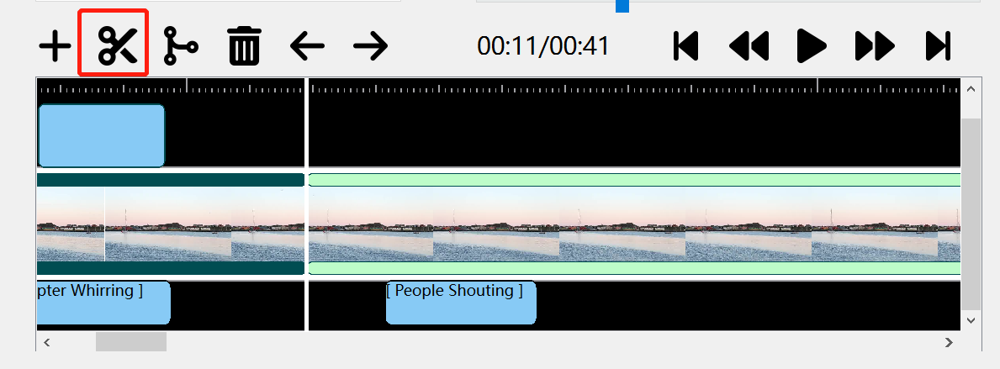

### 视频合并

将时间轴上的指针移动到某一位置，然后按下“合并”按钮，或点击“时间轴”——“合并”，即可智能地将指针位置前后的两个视频合二为一。操作及效果如下图所示。

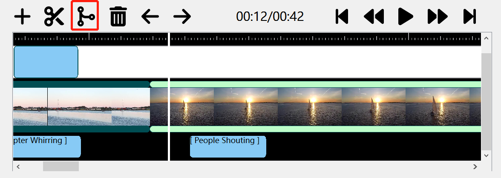

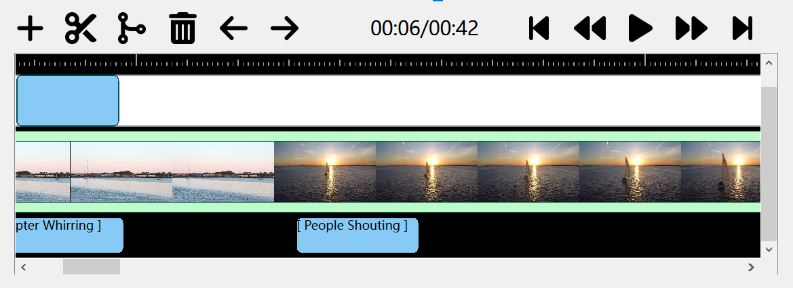

> 合并视频的具体规则为：
>
> 如果指针在时间轴中的第一个视频处，则只能将其和第二个视频合并。
>
> 如果指针在最后一个视频处，则只能与倒数第二个视频合并。
>
> 否则，视指针位于当前视频的具体位置来选择是与前一个视频还是后一个视频合并。（如果指针在前一半位置，则和前一个视频合并；否则与后一个合并）

### 调整片段顺序

如图，按下“向前调换“与”向后调换“按钮，则可将视频与其前一个/后一个视频（如果存在）调换位置。

也可以采用“时间轴”菜单中的“前移”“后移”按钮。

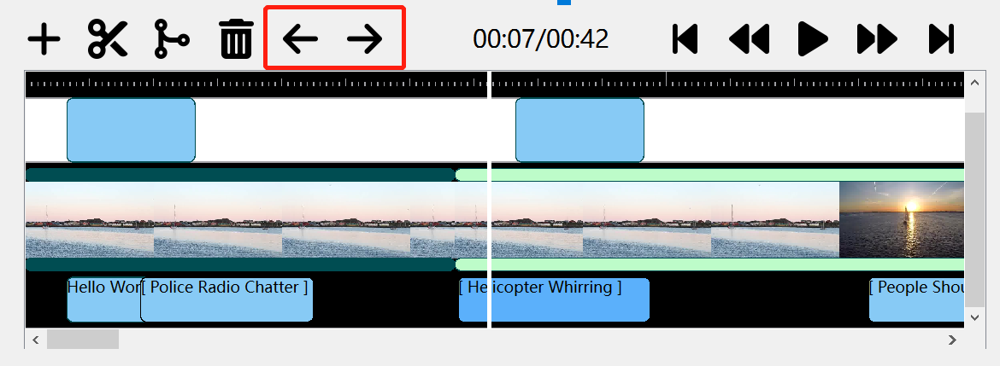

### 调整图片/文字素材的时间位置

选中某个轨道，并将指针移动到某个素材处，即可**定位**到该素材上。该素材的颜色将由浅蓝色变为深蓝色。

此后，可以按下"WASD"四个键盘按键，来调整被定位素材的时间位置。具体地，"W"表示向后增加一帧，"S"表示从后往前减少一帧，"A"表示素材整体向前移动一帧，"D"表示素材整体向后移动一帧。

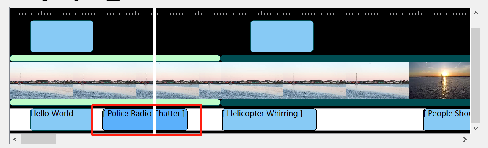

### 时间轴中素材删除

对于某个被定位到的素材，点击”删除“按钮，或点击“时间轴”——“删除”，即可将其从时间轴中移除，但并不会将其从素材库中彻底删除——这意味着用户还可以再次将其添加回时间轴中。

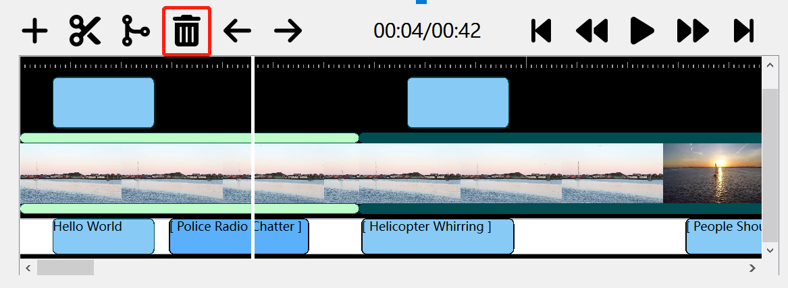

### 剪辑预览：调节播放位置

在预览窗口有一个滑块，可拖动它以改变当前时刻。

滑块下方粗略地显示了当前时间/总时间，此外还有五个按钮，用于进一步调整播放位置。它们分别是：

* 开始帧：将时间调回第一帧。
* 前移一帧：将时间轴往前微调一帧。
* 播放/暂停：控制预览窗口中视频的播放与否。
* 后移一帧：将时间往后微调一帧。
* 结束帧：将时间调到最后一帧。

这五个按钮也可以在菜单栏中的“预览”窗口调用。

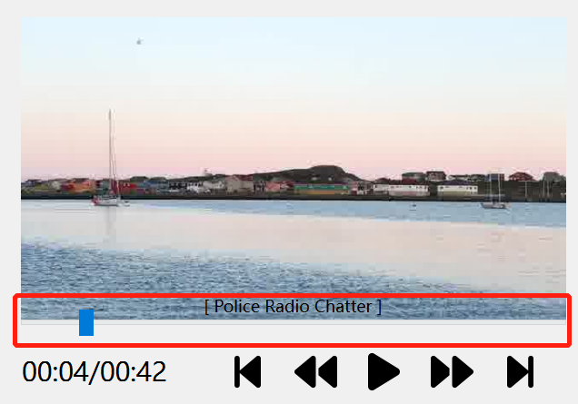

### 调节播放位置（提高要求）

在时间轴中，有一白色的指针能同步指示预览窗口当前帧对应的时间点。可以直接点击时间轴中任意位置（不能超过视频总时长），将指针移动到此处。此后，滑块也会被移动到对应位置。

### 添加图片特效

对于某个被定位到的图片素材，可以在菜单栏中选择“剪辑”——“特效”，选择特效添加。特效包含：淡入淡出、平移、缩放。选中指定特效后，会弹出对话框，请用户调整某些必要的参数（例如特效持续时间、平移距离、缩放比率）。此后就能在预览窗口观察到图片特效了。

### 视频导出（包含提高要求）

点击“文件”——“导出”，即可将剪辑好的视频导出到用户指定的路径下。所有的图片（包括特效）、文字、字幕都可作为视频的一部分被导出。

## 参考文献

1. [FFmpeg官方文档](https://ffmpeg.org/ffmpeg.html)（用于视频的抽帧、裁剪、导出等关键操作）
2. [QDrag官方文档](https://doc.qt.io/qt-6/qdrag.html)（帮助我实现了拖拽图片的功能）
3. [Font Awesome网站](http://www.fontawesome.com.cn/)（提供了多个按键的图标素材）
4. [Life of vids网站](https://www.lifeofvids.com/)（提供了视频素材）
5. [FFmpeg 抽帧教程](https://zhuanlan.zhihu.com/p/85895180)（提供了视频抽帧的方法）
